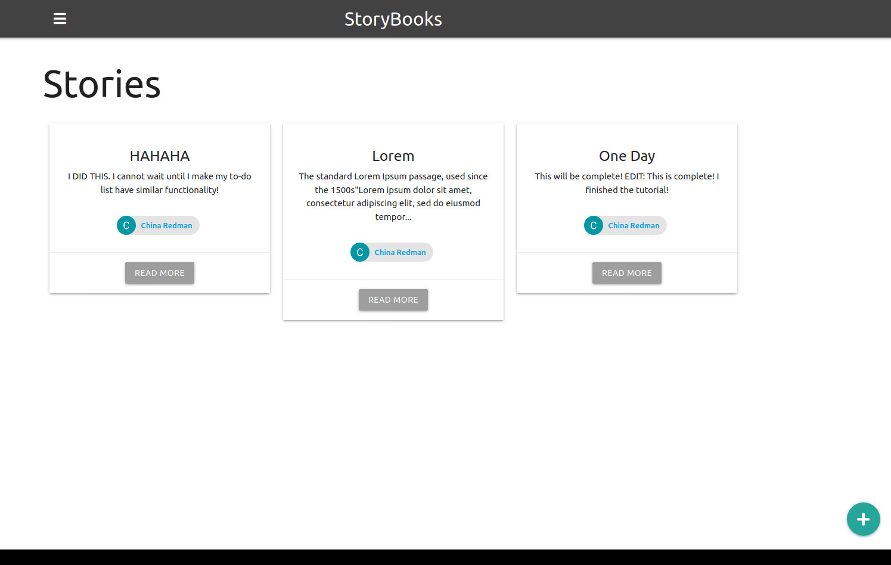

# StoryBooks
**Purpose:** StoryBooks is a web application that users can use to create public and private stories.

## How It's Made
**Tech used:** HTML, CSS, JavaScript, Express, MongoDB, Mongoose, Passport, Google OAuth, Sessions, and Handlebars  
**Lessons Learned:** I followed this full application build on YouTube to create a beatiful full-stack application with the purpose of learning how to ensure authentification for my To Do App. Thank you [Brad](https://traversymedia.com/), this was a big help.

Through building this application, I learned the following:
- how to incorporate Google OAuth
- how to ensure authorization on routes
- how to make stories public and private

